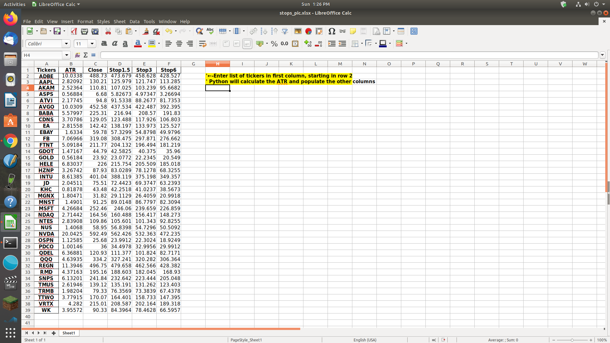

## ATR Stops
## -------------------------------------------------------------------------------------------  
### This python program calculates statistical based stops for a given list of tickers  
### Put the list of tickers in the spreadsheet named stops.xlsx located in the same location as this script
### Python will utilize the Yahoo Finance API to extract the prices needed to calculate the ATR and update the spreadsheet based on these  
### Review the spreadsheet and adjust your stops
### Statistical based stops are an alternative to round numbers based on areas of support and resistence.  They can be used to implement a trailing stop basis
## 
[Explanation of ATR](https://school.stockcharts.com/doku.php?id=technical_indicators:average_true_range_atr)

